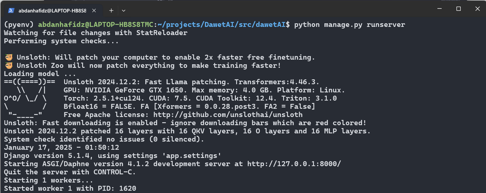
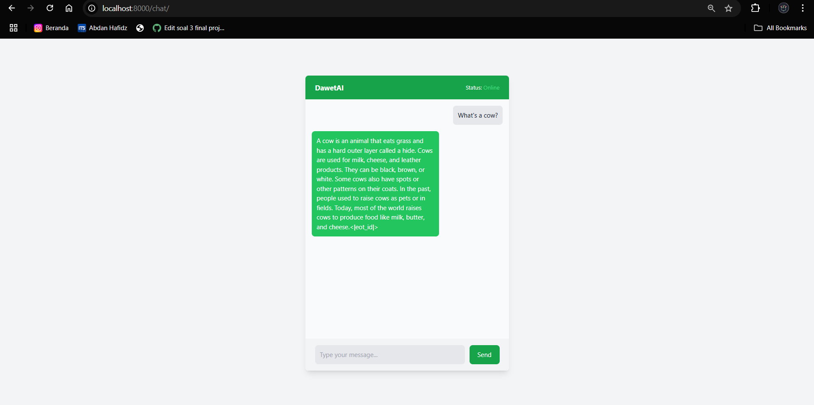

## Overview
This research focused on the application of LoRA+ for transfer learning on Llama 3.2 1B to an Indonesian domain, via the Cendol Collections corpus published by IndoNLP.

We (Me with my team) are doing this research purposed to Machine Learning and Data Mining Final Project. The research explores the application of the Parameter-Efficient Finetuning (PEFT) method Low-Rank Adaptation+ (LoRA+) on the transfer learning of Llama 3.2 1B, a large language model (LLM). As LLMs continue to grow in size, conventional finetuning becomes increasingly challenging and this approach quickly becomes computationally infeasible. To address this, the application of finetuning could be applied efficiently to certain components only, methods which are also called PEFT. The PEFT method LoRA+ is tested within this research for the transfer learning of Llama 3.2 1B to a new linguistic domain, that is the Indonesian language, using the metrics BLEU, ROUGE, and Weighted F1. The results show that the application of the LoRA+ method yields competitive and superior performance compared to the baseline in Indonesian linguistic capabilities, with improvements of 112% in BLEU scores and 21.7% in ROUGE-L scores, while maintaining relatively low standard deviations of 3.72 and 0.00075, respectively. Though Weighted F1 scores showed an expected decline of 13% due to domain shift, the model demonstrated robust cross-lingual transfer capabilities.

We use <a href="https://huggingface.co/datasets/indonlp/cendol_collection_v2">Cendol Collection </a> to fine tuning our model so it can be used for conversational in multilingualism for the languages given below : 
- English
- Indonesia, Bahasa
- Melayu, Bahasa
- Javanese
- Tagalog
- Sundanese
- and other Asian language families

You can see the notebook <a href="https://colab.research.google.com/drive/10-pVdwH1uNaW-t9HRrhk7tMQ58qD-0Fi?usp=sharing"> here </a>
My part in team was focused for **Model Deployment** scope as MLOps Engineer.

The final step in implementing a machine learning system is to ensure that the certified model can be implemented effectively. At this stage, ML operational engineers are responsible for answering critical infrastructure-related questions, such as how new data will be integrated into the model, whether predictions are made in batches or one at a time, acceptable latency tolerances, and mechanisms for user interaction with the system.

## Requirements

```text
attrs==23.2.0
Automat==22.10.0
Babel==2.10.3
bcrypt==3.2.2
blinker==1.7.0
certifi==2023.11.17
chardet==5.2.0
click==8.1.6
cloud-init==24.3.1
colorama==0.4.6
command-not-found==0.3
configobj==5.0.8
constantly==23.10.4
cryptography==41.0.7
dbus-python==1.3.2
distro==1.9.0
distro-info==1.7+build1
httplib2==0.20.4
hyperlink==21.0.0
idna==3.6
incremental==22.10.0
Jinja2==3.1.2
jsonpatch==1.32
jsonpointer==2.0
jsonschema==4.10.3
launchpadlib==1.11.0
lazr.restfulclient==0.14.6
lazr.uri==1.0.6
markdown-it-py==3.0.0
MarkupSafe==2.1.5
mdurl==0.1.2
netifaces==0.11.0
oauthlib==3.2.2
pyasn1==0.4.8
pyasn1-modules==0.2.8
pycurl==7.45.3
Pygments==2.17.2
PyGObject==3.48.2
PyHamcrest==2.1.0
PyJWT==2.7.0
pyOpenSSL==23.2.0
pyparsing==3.1.1
pyrsistent==0.20.0
pyserial==3.5
python-apt==2.7.7+ubuntu3
pytz==2024.1
PyYAML==6.0.1
requests==2.31.0
rich==13.7.1
service-identity==24.1.0
setuptools==68.1.2
six==1.16.0
systemd-python==235
Twisted==24.3.0
typing_extensions==4.10.0
ubuntu-pro-client==8001
unattended-upgrades==0.1
urllib3==2.0.7
wadllib==1.3.6
wheel==0.42.0
zope.interface==6.1
```

## Getting Started

To run the program, you can do the script below :

```shell
python manage.py runserver
```



After that, you can wait for a while the model getting loaded by the ```PredictService```.

## Engineering Technique Analysis

### *) Program Workflow


In this research, a web-based application was developed using the Django framework that implements the Model-View-Controller (MVC) design pattern with the integration of prediction services using WebSocket. The system flow as shown in Figure 4, is explained as follows:

### 1.Accessing the Website
Users access a web interface built with Django. This interface allows users to submit prompts via forms or endpoints provided.

You can run the django server and access it via ```http://localhost:8000```



### 2.Prompt Delivery to the Backend
After the user sends the prompt, the data is received by the controller. 

```python
#ChatController.py
from .Controller import Controller
class ChatController(Controller):
    global ctrl
    def __init__(self):
        super().__init__(self.loadViews().ChatView().getRenderTemplate)
    def show(self, request):
        return self.getResponse()
```

The controller is responsible for validating and forwarding the prompt to the prediction service.

```python
from . import Controller
class PredictController(Controller):
    def __init__(self, request):
        super().__init__(
            self.services().PredictService().Predict, 
            request.POST.get('InputTexts')
        )
        return self.getResponse()
```


### 3.Worker Executes Predictions
The prediction service pre-loads machine learning models to speed up execution. 

```python
# app/services/PredictService.py
from abc import abstractmethod
from . import Service
from app.config import Config
import os

class PredictService(Service):
    def __init__(self):
        model_path = os.path.abspath(os.path.join(os.getcwd(), "trained_model", "lora_model"))

        from transformers import TextStreamer
        from unsloth import FastLanguageModel
        import torch
        print("Loading model ... ")
        self.model, self.tokenizer = FastLanguageModel.from_pretrained(
            model_name=model_path,
            max_seq_length=2048,
            dtype=None,
            load_in_4bit=True,
        ) ### Pre-Loading the Model
        FastLanguageModel.for_inference(self.model)  # Enable faster inference

    def getModel(self):
        return self.model

    def getTokenizer(self):
        return self.tokenizer
predict_service = PredictService()
```

The Worker is a subprocess that performs prediction tasks independently of Django's main process. It takes a prompt, processes it using the model, and produces a text stream output as the result of the prediction.
```python
# worker_pool.py
import subprocess
import redis
import json
import signal
import time
import atexit
import threading
import os
python_interpreter = "/home/abdanhafidz/.pyenv/versions/dawetenv/bin/python"
worker_path = os.path.join("/home", "abdanhafidz", "projects", "DawetAI", "src", "dawetAI", "app", "worker", "worker.py")
class WorkerPool:
    _instance = None
    _lock = threading.Lock()
    
    def __init__(self, num_workers=1):
        self.num_workers = num_workers
        self.workers = []
        self.redis_client = redis.StrictRedis(host='localhost', port=6379, db=0)
        
        # Start workers
        self.start_workers()
        
        # Register cleanup on exit - only in main thread
        if threading.current_thread() is threading.main_thread():
            atexit.register(self.cleanup)
            # Only register signals in main thread
            self._setup_signal_handlers()

    def _setup_signal_handlers(self):
        """Setup signal handlers - should only be called from main thread"""
        signal.signal(signal.SIGINT, self.handle_interrupt)
        signal.signal(signal.SIGTERM, self.handle_interrupt)

    @classmethod
    def get_instance(cls, num_workers=1):
        """Thread-safe singleton pattern"""
        if cls._instance is None:
            with cls._lock:
                if cls._instance is None:
                    cls._instance = cls(num_workers)
        return cls._instance

    def start_workers(self):
        """Start the specified number of worker processes"""
        print(f"Starting {self.num_workers} workers...")
            # Path ke root direktori proyek
        project_root = "/home/abdanhafidz/projects/DawetAI/src/dawetAI"
        env = os.environ.copy()
        env["PYTHONPATH"] = project_root
        for i in range(self.num_workers):
            try:
                worker = subprocess.Popen(
                            f"source /home/abdanhafidz/projects/DawetAI/pyenv/bin/activate && python app/worker/worker.py",
                            shell=True,
                            executable="/bin/bash",
                            stdout=subprocess.PIPE,
                            stderr=subprocess.PIPE,
                            universal_newlines=True,
                            env=env
                        )
                # Add immediate output check
                # stdout, stderr = worker.communicate(timeout=60)
                # if stderr:
                #     print(f"Worker {i+1} error: {stderr}")
                # if stdout:
                #     print(f"Worker {i+1} output: {stdout}")
                    
                self.workers.append(worker)
                print(f"Started worker {i+1} with PID: {worker.pid}")
            except Exception as e:
                print(f"Failed to start worker {i+1}: {str(e)}")

    def submit_task(self, user_message, session_id):
        """Submit a new prediction task to the queue"""
        task = {
            'message': user_message,
            'session_id': session_id
        }
        
        # Push task to Redis queue
        self.redis_client.rpush("prediction_tasks", json.dumps(task))
    
    def get_results(self, session_id, timeout=30):
        """Generator that yields results as they become available"""
        while True:
            # Wait for new result with timeout
            result = self.redis_client.blpop(session_id, timeout=timeout)
            
            if result is None:
                print("Timeout waiting for results")
                break
            
            _, token = result
            token = token.decode('utf-8')
            
            if token == "[END]":
                break
            
            yield token

    def check_worker_health(self):
        """Check if all workers are still running"""
        with self._lock:
            for i, worker in enumerate(self.workers):
                if worker.poll() is not None:
                    print(f"Worker {i+1} has died, restarting...")
                    # Restart the worker
                    new_worker = subprocess.Popen(
                        ["python", "worker.py"],
                        stdout=subprocess.PIPE,
                        stderr=subprocess.PIPE
                    )
                    self.workers[i] = new_worker

    def cleanup(self):
        """Cleanup worker processes"""
        print("Cleaning up workers...")
        with self._lock:
            for worker in self.workers:
                worker.terminate()
                worker.wait()
        print("All workers terminated")

    def handle_interrupt(self, signum, frame):
        """Handle interrupt signals"""
        print("Received interrupt signal, shutting down...")
        self.cleanup()
        exit(0)
```
```python
# worker.py
import os
import sys
import django
import redis
import torch
import json
import logging
from datetime import datetime
from transformers import TextIteratorStreamer
from app.services import PredictService
from threading import Thread
# Add the project root directory to Python path
PROJECT_ROOT = os.path.abspath(os.path.join(os.path.dirname(__file__), "../../../"))
sys.path.append(PROJECT_ROOT)

# Set Django settings module
os.environ.setdefault('DJANGO_SETTINGS_MODULE', 'dawetAI.settings')

# Initialize Redis client
redis_client = redis.StrictRedis(host='localhost', port=6379, db=0)

# Configure logging
def setup_logger():
    """Configure logging to both file and console"""
    # Create logs directory if it doesn't exist
    log_dir = os.path.join(os.path.dirname(__file__), 'logs')
    os.makedirs(log_dir, exist_ok=True)
    log_file = os.path.join(log_dir, 'worker.log')
    
    logger = logging.getLogger('WorkerLogger')
    logger.setLevel(logging.INFO)
    
    # Create formatters
    file_formatter = logging.Formatter(
        '%(asctime)s [%(levelname)s] %(message)s',
        datefmt='%Y-%m-%d %H:%M:%S'
    )
    console_formatter = logging.Formatter(
        '%(asctime)s [%(levelname)s] %(message)s',
        datefmt='%H:%M:%S'
    )
    
    # File handler
    file_handler = logging.FileHandler(log_file)
    file_handler.setLevel(logging.INFO)
    file_handler.setFormatter(file_formatter)
    
    # Console handler
    console_handler = logging.StreamHandler(sys.stdout)
    console_handler.setLevel(logging.INFO)
    console_handler.setFormatter(console_formatter)
    
    # Add handlers to logger
    logger.addHandler(file_handler)
    logger.addHandler(console_handler)
    
    return logger

logger = setup_logger()


def process_prediction_stream(user_message, session_id, model, tokenizer):
    """
    Process a single prediction request
    """
    logger.info(f"Processing new prediction task - Session ID: {session_id}")
    logger.info(f"Input message: {user_message}")
    
    messages = [{"role": "system", "content": "Kamu adalah Asisten AI bernama Dawet yang dikembangkan oleh Mahasiswa di ITS (Institut Teknologi Sepuluh Nopember) Surabaya, program studi RKA (Rekayasa Kecerdasan Artifisial). ITS ada di Surabaya."},
                {"role": "user", "content": user_message}]
    logger.debug(f"Formatted messages: {messages}")
    
    try:
        inputs = tokenizer.apply_chat_template(
            messages,
            tokenize=True,
            add_generation_prompt=True,
            return_tensors="pt"
        ).to("cuda")
        
        logger.info("Starting prediction generation...")

        token_count = 0
        streamer = TextIteratorStreamer(tokenizer, skip_prompt=True)
        inputs = tokenizer.apply_chat_template(
            messages,
            tokenize = True,
            add_generation_prompt = True, # Must add for generation
            return_tensors = "pt",
        ).to("cuda")
        
        generation_kwargs = dict(inputs=inputs, streamer=streamer, max_new_tokens=128,
                                 min_new_tokens=64, repetition_penalty=1.1)
        thread = Thread(target=model.generate, kwargs=generation_kwargs)
        thread.start()

        for output_text in streamer:
            # output_text = tokenizer.decode(token, skip_special_tokens=True)
            logger.info(f"Generated token {output_text}")
            redis_client.rpush(session_id, output_text)
            token_count += 1
            if token_count % 10 == 0:  # Log every 10 tokens
                logger.info(f"Generated {token_count} tokens")
        
        logger.info(f"Prediction completed - Total tokens generated: {token_count}")
        
    except Exception as e:
        logger.error(f"Error during prediction generation: {str(e)}", exc_info=True)
        raise
    
    finally:
        redis_client.rpush(session_id, "[END]")
        logger.info("Stream ended - Session complete")

def run_worker():
    """
    Persistent worker that processes tasks from Redis queue
    """
    logger.info("Initializing worker process")
    
    try:
        # Setup Django environment
        django.setup()
        logger.info("Django setup completed")

        
        
        # Initialize model and tokenizer
        logger.info("Loading model and tokenizer...")
        predict_service = PredictService()
        model = predict_service.getModel()
        tokenizer = predict_service.getTokenizer()
        
        # Move model to CUDA
        model.to("cuda")
        logger.info("Model loaded and moved to CUDA successfully")
        
        logger.info("Worker initialization complete - Ready to process tasks")
        
        task_counter = 0
        while True:
            try:
                logger.debug("Waiting for new task...")
                _, task = redis_client.blpop("prediction_tasks")
                task_data = json.loads(task)
                
                task_counter += 1
                logger.info(f"Starting task #{task_counter} - Session: {task_data['session_id']}")
                
                process_prediction_stream(
                    task_data['message'],
                    task_data['session_id'],
                    model,
                    tokenizer
                )
                
                logger.info(f"Task #{task_counter} completed successfully")
                
            except json.JSONDecodeError as e:
                logger.error(f"Invalid task data received: {str(e)}")
                continue
                
            except Exception as e:
                logger.error(f"Error processing task #{task_counter}: {str(e)}", exc_info=True)
                redis_client.rpush(
                    task_data['session_id'],
                    f"[ERROR] {str(e)}"
                )
                redis_client.rpush(task_data['session_id'], "[END]")
                
    except Exception as e:
        logger.critical(f"Critical worker error: {str(e)}", exc_info=True)
        raise

if __name__ == "__main__":
    try:
        run_worker()
    except KeyboardInterrupt:
        logger.info("Worker shutdown requested")
    except Exception as e:
        logger.critical(f"Fatal error: {str(e)}", exc_info=True)
    finally:
        logger.info("Worker process terminated")
```

### 4.Use of Redis for Interprocess Communication
Redis is used as a cache database to store prediction result prompts and status. Worker and Django can communicate by exchanging data through Redis

```python
redis_client.rpush(session_id, output_text)
```

### 5.Streaming Prediction Results via WebSocket
After the worker processes the prompts and saves the results to Redis, WebSocket is used to send the prediction results in real-time, where the WebSocket connection allows Django to fetch data from Redis periodically and send it to the client continuously.

```python
# consumer.py
import json
from channels.generic.websocket import AsyncWebsocketConsumer
import redis
import asyncio
import uuid
from time import sleep
from app.worker import WorkerPool

# Create a single WorkerPool instance to be shared across all connections
worker_pool = WorkerPool(num_workers=1)

class PredictConsumer(AsyncWebsocketConsumer):
    async def connect(self):
        self.redis_client = redis.StrictRedis(host='localhost', port=6379, db=0)
        await self.accept()

    async def disconnect(self, close_code):
        # Cleanup if needed
        pass

    async def receive(self, text_data):
        try:
            data = json.loads(text_data)
            user_message = data['message']
            session_id = str(uuid.uuid4())

            print(f"Received prompt for session {session_id}: {user_message}")

            # Submit task to worker pool
            worker_pool.submit_task(user_message, session_id)

            # Stream results back to client
            try:
                while True:
                    token = self.redis_client.blpop(session_id, timeout=5)
                    if not token:
                        print("No new tokens, retrying...")
                        await asyncio.sleep(0.1)
                        continue

                    token = token[1].decode('utf-8')

                    if token == "[END]":
                        # Send completion message
                        await self.send(text_data=json.dumps({
                            'status': 'complete'
                        }))
                        break
                    elif token.startswith("[ERROR]"):
                        # Handle error case
                        await self.send(text_data=json.dumps({
                            'status': 'error',
                            'error': token[7:]  # Remove [ERROR] prefix
                        }))
                        break
                    else:
                        # Send token
                        await self.send(text_data=json.dumps({
                            'status': 'streaming',
                            'response': token
                        }))
                    await asyncio.sleep(0.000001)

            except Exception as e:
                print(f"Streaming error: {str(e)}")
                await self.send(text_data=json.dumps({
                    'status': 'error',
                    'error': f"Streaming error: {str(e)}"
                }))

        except Exception as e:
            print(f"Processing error: {str(e)}")
            await self.send(text_data=json.dumps({
                'status': 'error',
                'error': f"Processing error: {str(e)}"
            }))
```

## Future Feature Development
There are several improvement to do, somekind *Information Retrieval (IR)* from Wiki-pedia, Google, or other glosaries can be charged to the model loading process before predicting the result from given prompt, we can customize it via prompt frame : 

```python

messages = [{"role": "system", "content": "Kamu adalah Asisten AI bernama Dawet yang dikembangkan oleh Mahasiswa di ITS (Institut Teknologi Sepuluh Nopember) Surabaya, program studi RKA (Rekayasa Kecerdasan Artifisial). ITS ada di Surabaya."},
                {"role": "user", "content": user_message}]
```

Also the app hasn't featured with memoization previous result / prompt in the frame, i will be enhance that too.
